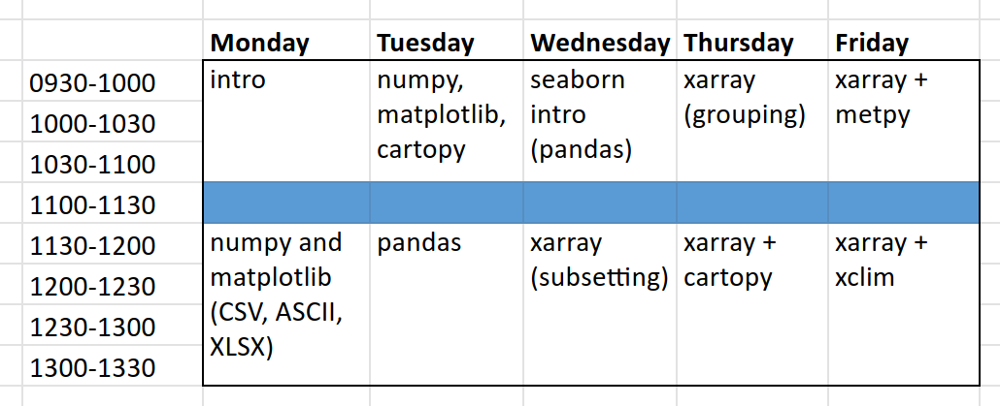
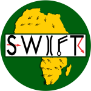

# FCFA-SWIFT Python training 2021

Hi!

You're looking at the repository for the 7th to 12th June 2021 FCFA
African-SWIFT Python training course.

The repository contains all the Jupyter notebooks which make up the course
training material (including example answers to the exercises)

## Course overview

The course time-table is below (note: all times are in local-time in
Ghana, so UTC+0)

The course is taught over a number of sessions, with each session introducing a new set of topics. Each session has an associated Jupyter notebook (see below) which contains background information introducing you to the topic and a set of exercises for you to work through.

- Monday:
  
  - numpy and matplotlib (using CSV, ASCII and XLXS files): [numpy_matplotlib.ipynb](notebooks/numpy_matplotlib.ipynb)

- Tuesday:
  
  - numpy, matplotlib & cartopy: [numpy_matplotlib_cartopy.ipynb](notebooks/numpy_matplotlib_cartopy.ipynb)
  
  - pandas: [pandas.ipynb](notebooks/pandas.ipynb)

- Wednesday:
  
  - pandas (with seaborn): [pandas_seaborn_.ipynb](notebooks/pandas_seaborn_.ipynb)
  
  - xarray (subsetting data): [xarray_part1.ipynb](notebooks/xarray_part1.ipynb)

- Thursday:
  
  - xarray (grouping data): [xarray_part2.ipynb](notebooks/xarray_part2.ipynb)
  
  - xarray + cartopy: [xarray_cartopy.ipynb](notebooks/xarray_cartopy.ipynb)

- Friday:
  
  - xarray + metpy: [xarray_metpy.ipynb](notebooks/xarray_metpy.ipynb)
  
  - xarray + cartopy: [xarray_xclim.ipynb](notebooks/xarray_xclim.ipynb)

All notebooks are stored in [notebooks/](notebooks/). There are also a set of sample answers for each exercise in [notebooks__sample_answers/](notebooks__sample_answers/) - but wait to look at this until after you've completed the course :)

## Getting started

**TODO**: add instructions on how to download/clone this repository and
how to get the datasets we will be working with

If you are having difficulty getting set up on your own computer you may
click the "launch on binder"-link above. **Note**: when you run the
exercises on binder what you write will not be saved locally and so you
will loose your work if you close the browser.

|  |  |
| --------------------------- | ---------------------------- |

